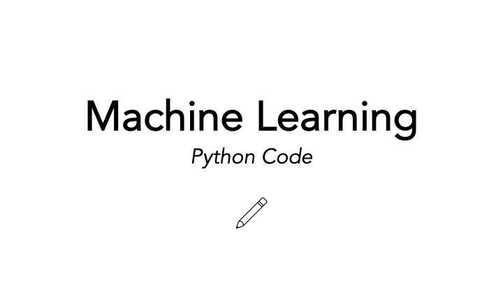
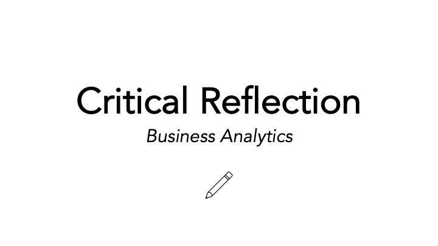

## Bachelor Thesis

This module focuses on independent academic research, including proposal development, literature analysis, and applied methodology.

::: {.card style="padding:15px; border-radius:10px; box-shadow:0 1.5px 6px var(--accent); text-align:center;"}
{style="width:100%; border-radius:8px; margin-bottom:10px;"}

::: {style="font-size:0.8rem; color:#4A6080; margin: 6px 0;"}
👤 Tom Blume &nbsp;|&nbsp; 📅 Oct. 2025
:::

::: {style="display:center; flex-wrap:wrap; gap:5px; margin-bottom:10px; text-align:center;"}
[Research]{.badge .bg-primary}
[Academic]{.badge .bg-secondary}
:::

[Research Proposal →](assets/_projects/_research_proposal.pdf){.btn .btn-accent .btn-sm}
:::

::: {.card style="padding:15px; border-radius:10px; box-shadow:0 1.5px 6px var(--accent); text-align:center;"}
{style="width:100%; border-radius:8px; margin-bottom:10px;"}

::: {style="font-size:0.8rem; color:#4A6080; margin: 6px 0;"}
👤 Tom Blume &nbsp;|&nbsp; 📅 Dec. 2025
:::

::: {style="display:center; flex-wrap:wrap; gap:5px; margin-bottom:10px; text-align:center;"}
[Research]{.badge .bg-primary}
[Academic]{.badge .bg-secondary}
:::

[Literature Review →](assets/_projects/_literature_review.pdf){.btn .btn-accent .btn-sm}
:::

::: {.card style="padding:15px; border-radius:10px; box-shadow:0 1.5px 6px var(--accent); text-align:center;"}
{style="width:100%; border-radius:8px; margin-bottom:10px;"}

::: {style="font-size:0.8rem; color:#4A6080; margin: 6px 0;"}
👤 Tom Blume &nbsp;|&nbsp; 📅 Apr. 2026
:::

::: {style="display:center; flex-wrap:wrap; gap:5px; margin-bottom:10px; text-align:center;"}
[Research]{.badge .bg-primary}
[Academic]{.badge .bg-secondary}
:::

[Coming Soon...](){.btn .btn-accent .btn-sm}
:::

---

## Business Analytics

This minor consists of: *Data Analytics: Machine Learning & Advanced Python*, *Workflow & Data Management*, and *Data Analytics: Programming & Visualisation*  - covered the process of handling and processing data, as well as applied machine learning and communicative visualisation

::: {.card style="padding:15px; border-radius:10px; box-shadow:0 1.5px 6px var(--accent); text-align:center;"}
{style="width:100%; border-radius:8px; margin-bottom:10px;"}

::: {style="font-size:0.8rem; color:#4A6080; margin: 6px 0;"}
👤 Tom Blume &nbsp;|&nbsp; 📅 Apr. 2026
:::

::: {style="display:center; flex-wrap:wrap; gap:5px; margin-bottom:10px; text-align:center;"}
[Research]{.badge .bg-primary}
[Academic]{.badge .bg-secondary}
:::

[ML Eassy →](assets/_projects/ml_ca.pdf){.btn .btn-accent .btn-sm}
:::

::: {.card style="padding:15px; border-radius:10px; box-shadow:0 1.5px 6px var(--accent); text-align:center;"}
{style="width:100%; border-radius:8px; margin-bottom:10px;"}

::: {style="font-size:0.8rem; color:#4A6080; margin: 6px 0;"}
👤 Tom Blume &nbsp;|&nbsp; 📅 Apr. 2026
:::

::: {style="display:center; flex-wrap:wrap; gap:5px; margin-bottom:10px; text-align:center;"}
[Code]{.badge .bg-primary}
[Academic]{.badge .bg-secondary}
:::

[Pyton Code →](python_code.qmd){.btn .btn-accent .btn-sm}
:::

::: {.card style="padding:15px; border-radius:10px; box-shadow:0 1.5px 6px var(--accent); text-align:center;"}
{style="width:100%; border-radius:8px; margin-bottom:10px;"}

::: {style="font-size:0.8rem; color:#4A6080; margin: 6px 0;"}
👤 Tom Blume &nbsp;|&nbsp; 📅 Apr. 2026
:::

::: {style="display:center; flex-wrap:wrap; gap:5px; margin-bottom:10px; text-align:center;"}
[Reflection]{.badge .bg-primary}
[Professional]{.badge .bg-secondary}
:::

[Reflection →](reflection.qmd){.btn .btn-accent .btn-sm}
:::

---

## New Enterprise Development 

This module explores the creation and evaluation of new business ventures, from idea development to market strategy and execution.

::: {.card style="padding:15px; border-radius:10px; box-shadow:0 1.5px 6px var(--accent); text-align:center;"}
{style="width:100%; border-radius:8px; margin-bottom:10px;"}

::: {style="font-size:0.8rem; color:#4A6080; margin: 6px 0;"}
👤 Groupe 22 &nbsp;|&nbsp; 📅 Oct. 2025
:::

::: {style="display:center; flex-wrap:wrap; gap:5px; margin-bottom:10px; text-align:center;"}
[Concept]{.badge .bg-primary}
[Professional]{.badge .bg-secondary}
:::

[Concept Paper →](assets/_projects/_concept_paper.pdf){.btn .btn-accent .btn-sm}
:::

::: {.card style="padding:15px; border-radius:10px; box-shadow:0 1.5px 6px var(--accent); text-align:center;"}
{style="width:100%; border-radius:8px; margin-bottom:10px;"}

::: {style="font-size:0.8rem; color:#4A6080; margin: 6px 0;"}
👤 Groupe 22 &nbsp;|&nbsp; 📅 Dec. 2025
:::

::: {style="display:center; flex-wrap:wrap; gap:5px; margin-bottom:10px; text-align:center;"}
[Analysis]{.badge .bg-primary}
[Professional]{.badge .bg-secondary}
:::

[Feasibility Report →](assets/_projects/_feasibility_report.pdf){.btn .btn-accent .btn-sm}
:::

::: {.card style="padding:15px; border-radius:10px; box-shadow:0 1.5px 6px var(--accent); text-align:center;"}
{style="width:100%; border-radius:8px; margin-bottom:10px;"}

::: {style="font-size:0.8rem; color:#4A6080; margin: 6px 0;"}
👤 Groupe 22 &nbsp;|&nbsp; 📅 Feb. 2025
:::

::: {style="display:center; flex-wrap:wrap; gap:5px; margin-bottom:10px; text-align:center;"}
[Report]{.badge .bg-primary}
[Professional]{.badge .bg-secondary}
:::

[Marketing Report →](assets/_projects/_marketing_report.pdf){.btn .btn-accent .btn-sm}
:::

::: {.card style="padding:15px; border-radius:10px; box-shadow:0 1.5px 6px var(--accent); text-align:center;"}
{style="width:100%; border-radius:8px; margin-bottom:10px;"}

::: {style="font-size:0.8rem; color:#4A6080; margin: 6px 0;"}
👤 Groupe 22 &nbsp;|&nbsp; 📅 Feb. 2025
:::

::: {style="display:center; flex-wrap:wrap; gap:5px; margin-bottom:10px; text-align:center;"}
[Video]{.badge .bg-primary}
[Professional]{.badge .bg-secondary}
:::

[Marketing Video →](https://www.youtube.com/watch?v=1A4hBhPMogE){.btn .btn-accent .btn-sm}
:::

::: {.card style="padding:15px; border-radius:10px; box-shadow:0 1.5px 6px var(--accent); text-align:center;"}
{style="width:100%; border-radius:8px; margin-bottom:10px;"}

::: {style="font-size:0.8rem; color:#4A6080; margin: 6px 0;"}
👤 Groupe 22 &nbsp;|&nbsp; 📅 Mar. 2025
:::

::: {style="display:center; flex-wrap:wrap; gap:5px; margin-bottom:10px; text-align:center;"}
[Pitch]{.badge .bg-primary}
[Professional]{.badge .bg-secondary}
:::

[Pitch Deck →](assets/_projects/_pitch_deck.pdf){.btn .btn-accent .btn-sm}
:::

::: {.card style="padding:15px; border-radius:10px; box-shadow:0 1.5px 6px var(--accent); text-align:center;"}
{style="width:100%; border-radius:8px; margin-bottom:10px;"}

::: {style="font-size:0.8rem; color:#4A6080; margin: 6px 0;"}
👤 Groupe 22 &nbsp;|&nbsp; 📅 Apr. 2025
:::

::: {style="display:center; flex-wrap:wrap; gap:5px; margin-bottom:10px; text-align:center;"}
[Strategy]{.badge .bg-primary}
[Professional]{.badge .bg-secondary}
:::

[Coming Soon...](){.btn .btn-accent .btn-sm}
:::

