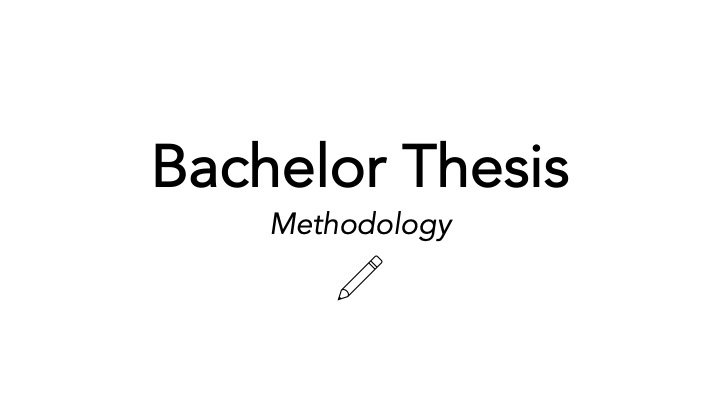
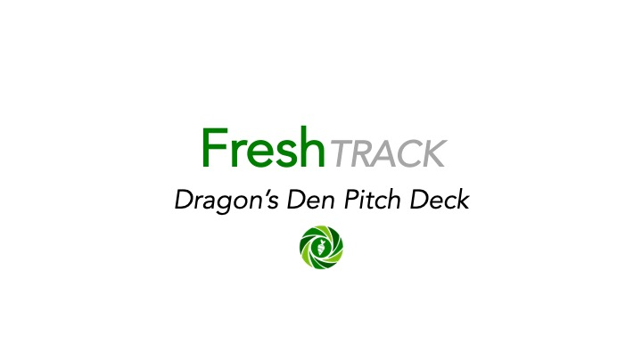
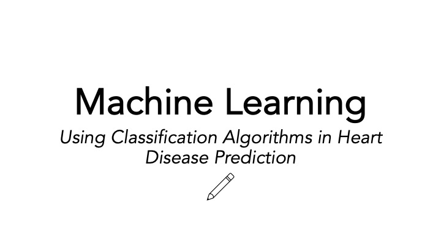

## Bachelor Thesis

This module focuses on independent academic research, including proposal development, literature analysis, and applied methodology.

::: {.card style="padding:15px; border-radius:10px; box-shadow:0 2px 8px #00bfff; text-align:center;"}
{style="width:100%; border-radius:8px; margin-bottom:10px;"}
[Research Proposal →](assets/_projects/_research_proposal.pdf){.btn .btn-secondary .btn-sm}
:::

::: {.card style="padding:15px; border-radius:10px; box-shadow:0 2px 8px #00bfff; text-align:center;"}
{style="width:100%; border-radius:8px; margin-bottom:10px;"}
[Literature Review →](assets/_projects/_literature_review.pdf){.btn .btn-secondary .btn-sm}
:::

::: {.card style="padding:15px; border-radius:10px; box-shadow:0 2px 8px #00bfff; text-align:center;"}
{style="width:100%; border-radius:8px; margin-bottom:10px;"}
[Coming Soon...](){.btn .btn-secondary .btn-sm}
:::

---

## New Enterprise Development 

This module explores the creation and evaluation of new business ventures, from idea development to market strategy and execution.

::: {.card style="padding:15px; border-radius:10px; box-shadow:0 2px 8px #00bfff; text-align:center;"}
{style="width:100%; border-radius:8px; margin-bottom:10px;"}
[Concept Paper →](assets/_projects/_concept_paper.pdf){.btn .btn-secondary .btn-sm}
:::

::: {.card style="padding:15px; border-radius:10px; box-shadow:0 2px 8px #00bfff; text-align:center;"}
{style="width:100%; border-radius:8px; margin-bottom:10px;"}
[Feasibility Report →](assets/_projects/_feasibility_report.pdf){.btn .btn-secondary .btn-sm}
:::

::: {.card style="padding:15px; border-radius:10px; box-shadow:0 2px 8px #00bfff; text-align:center;"}
{style="width:100%; border-radius:8px; margin-bottom:10px;"}
[Marketing Report →](assets/_projects/_marketing_report.pdf){.btn .btn-secondary .btn-sm}
:::

::: {.card style="padding:15px; border-radius:10px; box-shadow:0 2px 8px #00bfff; text-align:center;"}
{style="width:100%; border-radius:8px; margin-bottom:10px;"}
[Marketing Video →](https://www.youtube.com/watch?v=1A4hBhPMogE){.btn .btn-secondary .btn-sm}
:::

::: {.card style="padding:15px; border-radius:10px; box-shadow:0 2px 8px #00bfff; text-align:center;"}
{style="width:100%; border-radius:8px; margin-bottom:10px;"}
[Pitch Deck →](assets/_projects/_pitch_deck.pdf){.btn .btn-secondary .btn-sm}
:::

::: {.card style="padding:15px; border-radius:10px; box-shadow:0 2px 8px #00bfff; text-align:center;"}
{style="width:100%; border-radius:8px; margin-bottom:10px;"}
[Coming Soon...](){.btn .btn-secondary .btn-sm}
:::

---

## Machine Learning & Advanced Python 

This module covers machine learning techniques and advanced Python applications for data analysis and predictive modeling.

::: {.card style="padding:15px; border-radius:10px; box-shadow:0 2px 8px #00bfff; text-align:center;"}
{style="width:100%; border-radius:8px; margin-bottom:10px;"}
[ML Eassy →](assets/_projects/ml_ca.pdf){.btn .btn-secondary .btn-sm}
:::

::: {.card style="padding:15px; border-radius:10px; box-shadow:0 2px 8px #00bfff; text-align:center;"}
{style="width:100%; border-radius:8px; margin-bottom:10px;"}
[ML Pyton Code →](python_code.qmd){.btn .btn-secondary .btn-sm}
:::

